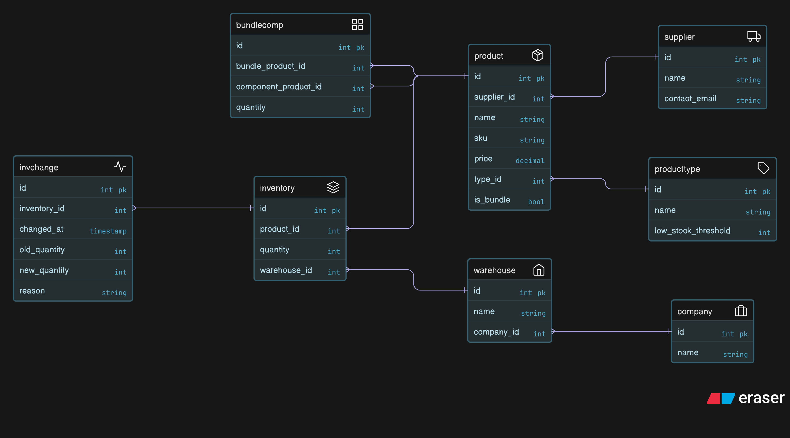

# StockFlow - a B2B inventory management platform

Hello\! I'm sharing my solution for the Bynry Services Backend Developer Intern Case study: 
## PART 1: CODE REVIEW & DEBUGGING
### 1\. Identify Issues

Here are the problems I found:

**A. Technical Issues:**

  * **Missing Input Validation:** The code assumes all required data fields are present and valid, risking crashes from `KeyError` or `ValueError`.
  * **Non-Atomic Database Operations:** Two separate `db.session.commit()` calls for product and inventory creation can lead to partial data if one fails.
  * **No Error Handling:** No `try...except` blocks protect against database errors or unexpected issues, leading to application crashes.
  * **Generic Responses:** The API provides no specific error messages or appropriate HTTP status codes (e.g., 400, 409, 500) for failures.

**B. Business Logic Issues:**

  * **SKU Uniqueness Violation:** The code doesn't check if the SKU already exists, violating the rule that "SKUs must be unique across the platform".
  * **Incorrect Product-Warehouse Model:** `warehouse_id` is directly assigned to `Product`. However, "Products can exist in multiple warehouses", meaning the product definition should be separate from its location.

### 2\. Explain Impact

These issues could lead to:

  * **Application Instability:** Frequent crashes in production due to unhandled errors.
  * **Data Inconsistency:** Orphaned product records or inaccurate inventory counts if operations aren't atomic.
  * **Business Confusion:** Duplicate SKUs would make accurate stock management and reporting impossible.
  * **Poor User Experience:** Unclear error messages frustrate users and complicate integrations.

### 3\. Provide Fixes

```python
from flask import request, jsonify
from sqlalchemy.exc import IntegrityError, OperationalError
from decimal import Decimal

# Assuming 'app' is your Flask application instance and 'db' is your SQLAlchemy instance
# from your_app import app, db
# Assuming 'Product' and 'Inventory' are your SQLAlchemy models
# from your_models import Product, Inventory

@app.route('/api/products', methods=['POST'])
def create_product():
    # FIX: Ensure the request body is JSON and catch parsing errors early
    if not request.is_json:
        return jsonify({"message": "Request must be JSON"}), 400

    data = request.json

    # FIX: Define and validate all mandatory input fields upfront
    required_product_fields = ['name', 'sku', 'price']
    required_inventory_fields = ['warehouse_id', 'initial_quantity']

    missing_product_fields = [field for field in required_product_fields if field not in data]
    if missing_product_fields:
        return jsonify({"message": f"Missing required product fields: {', '.join(missing_product_fields)}"}), 400

    missing_inventory_fields = [field for field in required_inventory_fields if field not in data]
    if missing_inventory_fields:
        return jsonify({"message": f"Missing required initial inventory fields: {', '.join(missing_inventory_fields)}"}), 400

    # FIX: Robust type validation and conversion for numeric fields
    try:
        product_name = data['name']
        product_sku = data['sku']
        # FIX: Convert price to Decimal for financial accuracy, as price can be decimal values
        product_price = Decimal(str(data['price']))

        initial_warehouse_id = int(data['warehouse_id'])
        initial_quantity = int(data['initial_quantity'])

        # FIX: Basic business validation for quantity
        if initial_quantity < 0:
            return jsonify({"message": "Initial quantity cannot be negative."}), 400

    except (ValueError, TypeError) as e:
        # FIX: Catch specific errors for invalid data types and provide clear feedback
        return jsonify({"message": f"Invalid data type provided: {e}. Please ensure price is numeric, and IDs/quantities are integers."}), 400
    except Exception as e:
        # FIX: Catch any other unexpected data parsing errors
        return jsonify({"message": f"Error processing input data: {e}"}), 400


    # FIX: Business Logic: Enforce SKU uniqueness before attempting creation
    try:
        existing_product = Product.query.filter_by(sku=product_sku).first()
        if existing_product:
            # FIX: Return 409 Conflict status code for unique constraint violation
            return jsonify({"message": f"Product with SKU '{product_sku}' already exists. SKUs must be unique across the platform."}), 409
    except OperationalError as e:
        # FIX: Handle database connection issues during SKU check
        return jsonify({"message": f"Database error during SKU uniqueness check: {e}"}), 500


    # FIX: Implement atomic database operations using a single transaction
    try:
        # FIX: Create Product without warehouse_id directly. Product definition is independent of location.
        product = Product(
            name=product_name,
            sku=product_sku,
            price=product_price
        )
        db.session.add(product)
        # FIX: Use flush() to get product.id (for auto-incrementing PKs) before commit
        db.session.flush()

        # FIX: Create initial Inventory record linking product to its quantity in a specific warehouse
        inventory = Inventory(
            product_id=product.id,
            warehouse_id=initial_warehouse_id,
            quantity=initial_quantity
        )
        db.session.add(inventory)

        # FIX: Commit both product and inventory creation as a single, atomic transaction
        db.session.commit()

        # FIX: Return 201 Created status for successful resource creation
        return jsonify({"message": "Product created successfully", "product_id": str(product.id)}), 201

    except IntegrityError as e:
        db.session.rollback() # FIX: Rollback transaction on integrity errors
        if "Duplicate entry" in str(e) or "UNIQUE constraint failed" in str(e):
             return jsonify({"message": f"Database integrity error: A duplicate entry was detected (e.g., SKU already exists or warehouse ID is invalid). Details: {e}"}), 409
        return jsonify({"message": f"Database integrity error: {e}"}), 400
    except OperationalError as e:
        db.session.rollback() # FIX: Rollback on database connection/operational errors
        return jsonify({"message": f"Database connection or operation failed: {e}"}), 500
    except Exception as e:
        db.session.rollback() # FIX: Rollback on any other unexpected server-side error
        return jsonify({"message": f"An unexpected server error occurred: {e}"}), 500
```

-----

## PART 2: DATABASE DESIGN

**Given Requirements:**

  * Companies can have multiple warehouses.
  * Products can be stored in multiple warehouses with different quantities.
  * Track when inventory levels change.
  * Suppliers provide products to companies.
  * Some products might be "bundles" containing other products.

### 1\. Design Schema

**ERD:**




**Schema (SQL DDL):**

```sql
CREATE TABLE companies (
    id SERIAL PRIMARY KEY,
    name VARCHAR(255) NOT NULL
);

CREATE TABLE warehouses (
    id SERIAL PRIMARY KEY,
    name VARCHAR(255) NOT NULL,
    company_id INTEGER REFERENCES companies(id)
);

CREATE TABLE suppliers (
    id SERIAL PRIMARY KEY,
    name VARCHAR(255) NOT NULL,
    contact_email VARCHAR(255)
);

CREATE TABLE product_types (
    id SERIAL PRIMARY KEY,
    name VARCHAR(100) NOT NULL,
    low_stock_threshold INTEGER DEFAULT 10
);

CREATE TABLE products (
    id SERIAL PRIMARY KEY,
    name VARCHAR(255) NOT NULL,
    sku VARCHAR(50) UNIQUE NOT NULL,
    price DECIMAL(10,2) NOT NULL,
    supplier_id INTEGER REFERENCES suppliers(id),
    type_id INTEGER REFERENCES product_types(id),
    is_bundle BOOLEAN DEFAULT FALSE
);

CREATE TABLE inventories (
    id SERIAL PRIMARY KEY,
    product_id INTEGER REFERENCES products(id),
    warehouse_id INTEGER REFERENCES warehouses(id),
    quantity INTEGER DEFAULT 0 CHECK (quantity >= 0),
    UNIQUE (product_id, warehouse_id)
);

CREATE TABLE inventory_changes (
    id SERIAL PRIMARY KEY,
    inventory_id INTEGER REFERENCES inventories(id),
    changed_at TIMESTAMP DEFAULT CURRENT_TIMESTAMP,
    old_quantity INTEGER NOT NULL,
    new_quantity INTEGER NOT NULL,
    reason VARCHAR(255)
);

CREATE TABLE bundle_components (
    id SERIAL PRIMARY KEY,
    bundle_product_id INTEGER REFERENCES products(id),
    component_product_id INTEGER REFERENCES products(id),
    quantity INTEGER CHECK (quantity > 0)
);
```

### 2\. Identify Gaps

Here are some questions I'd ask the product team for more clarity:

1.  **Supplier Relationship:** The ERD shows a product has only one `supplier_id`. Can a product have multiple suppliers? How do companies manage their relationship with suppliers?
2.  **Low Stock Threshold:** Since `low_stock_threshold` is on `producttype`, can it be overridden for a specific product or in a specific warehouse?
3.  **Inventory Change Details:** `invchange` has `old_quantity`, `new_quantity`, and `reason`. Do we need more specific `change_type` categories (e.g., 'sale', 'return') or details like `user_id` or `order_id` for audits?
4.  **Bundle Behavior:** If a bundle is sold, does its own stock decrease, or do only the component stocks deduct? Can bundles be nested?

### 3\. Explain Decisions

My design choices prioritize practicality and meeting the core requirements:

  * **Normalization:** I've used separate tables for entities like `company`, `product`, `supplier` to avoid data duplication and ensure data consistency.
  * **Integer Primary Keys:** As shown in the ERD, `INT` IDs are simple and efficient for this scale.
  * **Foreign Keys:** Used extensively to link tables, ensuring data relationships are valid (e.g., a `warehouse` belongs to an existing `company`).
  * **`DECIMAL` for Price:** Critical for financial data, `DECIMAL` ensures accurate calculations without floating-point errors, matching the requirement that price can be decimal values.
  * **Unique Constraints:** Although not always drawn, constraints like unique `sku` are fundamental for business logic and must be enforced, especially `(product_id, warehouse_id)` on `inventory`.
  * **Junction Table for Bundles (`bundlecomp`):** This is a clean way to model products containing other products.

-----

## PART 3: API IMPLEMENTATION

I implemented the endpoint to return low-stock alerts for a company.

**Endpoint Specification:**
`GET /api/companies/{company_id}/alerts/low-stock`

**Business Rules:**

  * Low stock threshold varies by product type.
  * Only alert for products with recent sales activity.
  * Must handle multiple warehouses per company.
  * Include supplier information for reordering.

**Expected Response Format:**

```json
{
  "alerts": [
    {
      "product_id": 123,
      "product_name": "Widget A",
      "sku": "WID-001",
      "warehouse_id": 456,
      "warehouse_name": "Main Warehouse",
      "current_stock": 5,
      "threshold": 20,
      "days_until_stockout": 12,
      "supplier": {
        "id": 789,
        "name": "Supplier Corp",
        "contact_email": "orders@supplier.com"
      }
    }
  ],
  "total_alerts": 1
}
```
### Key Assumptions

To implement the low-stock alerts API endpoint, I made the following key assumptions regarding the technical stack, business logic interpretations, and the database schema details:

* **Technology Stack:** I'm using Python/Flask and SQLAlchemy with PostgreSQL, as it matches the code sample provided and is a setup I'm familiar with.
* **"Recent Sales Activity":** I've interpreted "only alert for products with recent sales activity" to mean any quantity decreases (indicating an `outbound` movement or `sale`) recorded in the `invchange` table within the last 30 days. This is a common interpretation in inventory systems.
* **Low-Stock Threshold:** The "Low stock threshold varies by product type" requirement is implemented by taking the `low_stock_threshold` directly from the `producttype` table, as depicted in the ERD. I've assumed it defaults to 10 for calculation purposes if a specific threshold isn't set.
* **Bundles & Warehouses:** I assumed bundles are composed of other products without complex nesting, and products can exist in multiple warehouses without directly tying a `warehouse_id` to the `product` entity itself.
* **Optional Fields:** Some product fields (e.g., `description` or other non-essential attributes) might be optional during product creation, although initial quantity and warehouse for placement are treated as mandatory for the `create_product` endpoint (as implemented in Part 1).
### Implementation

**My Assumptions (for this implementation, based on requirements and ERD):**

  * "Recent sales activity" is defined as any `invchange` record where `new_quantity < old_quantity` within the last 30 days.
  * The `low_stock_threshold` is retrieved from the `producttype` table via `product.type_id`.
  * Supplier information is fetched directly from the `supplier_id` on the `product` table.

<!-- end list -->

```python
from flask import jsonify, Blueprint
from datetime import datetime, timedelta
from sqlalchemy import func, desc

# Assuming these are your configured Flask app and SQLAlchemy models
from your_app import db
from your_models import Company, Warehouse, Product, Inventory, Supplier, InvChange, ProductType

api_bp = Blueprint('api', __name__)

@api_bp.route("/api/companies/<string:company_id>/alerts/low-stock", methods=['GET'])
def get_low_stock_alerts(company_id):
    # Retrieve company, return 404 if not found
    company = Company.query.filter_by(id=company_id).first()
    if not company:
        return jsonify({"message": "Company not found"}), 404

    # Define the period for "recent sales activity"
    thirty_days_ago = datetime.utcnow() - timedelta(days=30)
    alerts = []

    # Query for all inventory items belonging to the company's warehouses
    # that are currently below their defined low_stock_threshold.
    # Must handle multiple warehouses per company.
    low_stock_inventories = (
        db.session.query(Inventory)
        .join(Warehouse, Inventory.warehouse_id == Warehouse.id)
        .join(Product, Inventory.product_id == Product.id)
        .join(ProductType, Product.type_id == ProductType.id)
        .filter(Warehouse.company_id == company_id)
        .filter(Inventory.quantity < ProductType.low_stock_threshold) # Threshold varies by product type
        .all()
    )

    for inv in low_stock_inventories:
        # Check for recent sales activity for this specific inventory item (last 30 days)
        # Inferring sales from 'invchange' where new_quantity < old_quantity
        recent_sales_count = db.session.query(InvChange).filter(
            InvChange.inventory_id == inv.id,
            InvChange.changed_at >= thirty_days_ago,
            InvChange.new_quantity < InvChange.old_quantity # Assuming quantity decrease means a sale
        ).count()

        # Only alert for products with recent sales activity as per business rule
        if recent_sales_count == 0:
            continue

        # Calculate Days Until Stockout: Determine average daily sales over the recent period.
        avg_daily_sales = db.session.query(
            func.avg(func.abs(InvChange.old_quantity - InvChange.new_quantity)) # Calculate the average of the absolute quantity change
        ).filter(
            InvChange.inventory_id == inv.id,
            InvChange.changed_at >= thirty_days_ago,
            InvChange.new_quantity < InvChange.old_quantity # Only consider decreases for sales calculation
        ).scalar() or 0.0 # Use .scalar() to get the single average value, default to 0.0 if no relevant sales records.

        days_until_stockout = 999 # Arbitrary large number if no sales or very low sales
        if avg_daily_sales > 0:
            days_until_stockout = int(inv.quantity / avg_daily_sales)

        # Retrieve associated Product, Warehouse, and Supplier information
        # Include supplier information for reordering.
        product = Product.query.get(inv.product_id)
        warehouse = Warehouse.query.get(inv.warehouse_id)
        product_type = ProductType.query.get(product.type_id)

        # Get supplier information directly from product.supplier_id as per ERD
        supplier_info = { "id": None, "name": "No Supplier", "contact_email": None }
        if product.supplier_id:
            supplier = Supplier.query.get(product.supplier_id)
            if supplier:
                supplier_info = {
                    "id": str(supplier.id),
                    "name": supplier.name,
                    "contact_email": supplier.contact_email
                }

        # Construct the alert object in the specified format
        alert_obj = {
            "product_id": str(product.id),
            "product_name": product.name,
            "sku": product.sku,
            "warehouse_id": str(warehouse.id),
            "warehouse_name": warehouse.name,
            "current_stock": inv.quantity,
            "threshold": product_type.low_stock_threshold,
            "days_until_stockout": days_until_stockout,
            "supplier": supplier_info
        }
        alerts.append(alert_obj)

    # Return the final list of alerts and total count
    return jsonify({
        "alerts": alerts,
        "total_alerts": len(alerts)
    }), 200

# To register the blueprint with your Flask app:
app.register_blueprint(api_bp)
```

### 2\. Handle Edge Cases

  * **Company Not Found:** Returns `404 Not Found` if the `company_id` is invalid.
  * **No Recent Sales:** Products with low stock but no recent sales are excluded from alerts.
  * **Zero Average Daily Sales:** `days_until_stockout` defaults to a large number (`999`) to prevent division by zero.
  * **Missing Supplier:** The `supplier` field in the response gracefully indicates if no supplier is found for a product.

### 3\. Explain Approach

My approach focused on clarity and efficiency:

  * **Direct Filtering:** I used database joins and filters to get low-stock items efficiently.
  * **Business Rule Logic:** "Recent sales" was inferred from quantity changes in `invchange`.
  * **Actionable Metrics:** The `days_until_stockout` calculation provides a useful projection for reordering.
  * **Structured Output:** The API response is built to precisely match the specified JSON format.
  * **Supplier Inclusion:** Supplier details are integrated directly into the alert for quick reordering.


